# 📘 Platform Workflow — Full Specification
> Exam Management Platform (Teacher · Student · Super Admin)
> Version: 1.2 | Status: Updated with owner clarifications | All discrepancies resolved

---

## Table of Contents

1. [System Overview](#1-system-overview)
2. [Role Summary](#2-role-summary)
3. [Super Admin Flow](#3-super-admin-flow)
4. [Teacher Flow](#4-teacher-flow)
5. [Student Flow](#5-student-flow)
6. [Coin / Wallet System](#6-coin--wallet-system)
7. [Exam Visibility & Cost Logic](#7-exam-visibility--cost-logic)
8. [Data Models (Summary)](#8-data-models-summary)
9. [Full System Flow Diagram](#9-full-system-flow-diagram)
10. [Appendix — Key Business Rules](#appendix--key-business-rules)

---

## 1. System Overview

This platform is a multi-role online examination system supporting three actor types:

| Actor | Entry Point | Account Creation |
|---|---|---|
| Super Admin | `/admin` | Hardcoded `.env` credentials |
| Teacher | `/teacher` | Created by Super Admin only |
| Student | `/student` | Self-registration with email OTP |

The system uses a virtual currency called **Devo-coin** to manage exam costs across teacher and student wallets. Exam cost is calculated per-question and deducted at exam attempt time.

> **Product Positioning:** This is primarily a **teacher-centric exam-conducting platform**. Teachers create, manage, and monetize their exams. Students can attempt teacher-assigned private exams (batch-based) or browse and attempt publicly available global exams. The platform enables independent teachers and small coaching setups to run professional computer-based tests without building their own infrastructure.

---

## 2. Role Summary

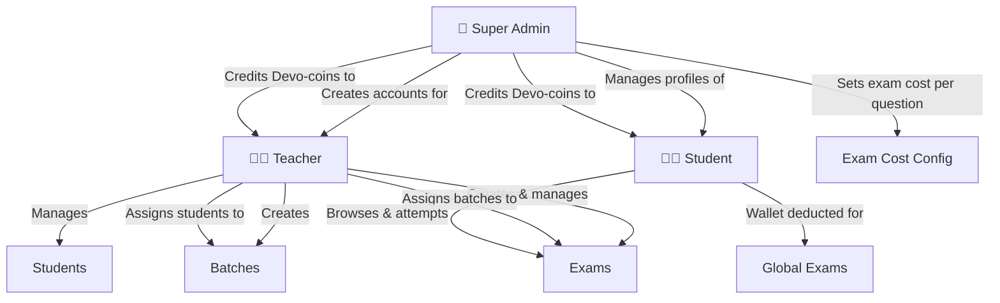

---

## 3. Super Admin Flow

### 3.1 Login

- Credentials are **hardcoded in `.env`** (Email + Password).
- No registration or forgot-password flow for Super Admin.

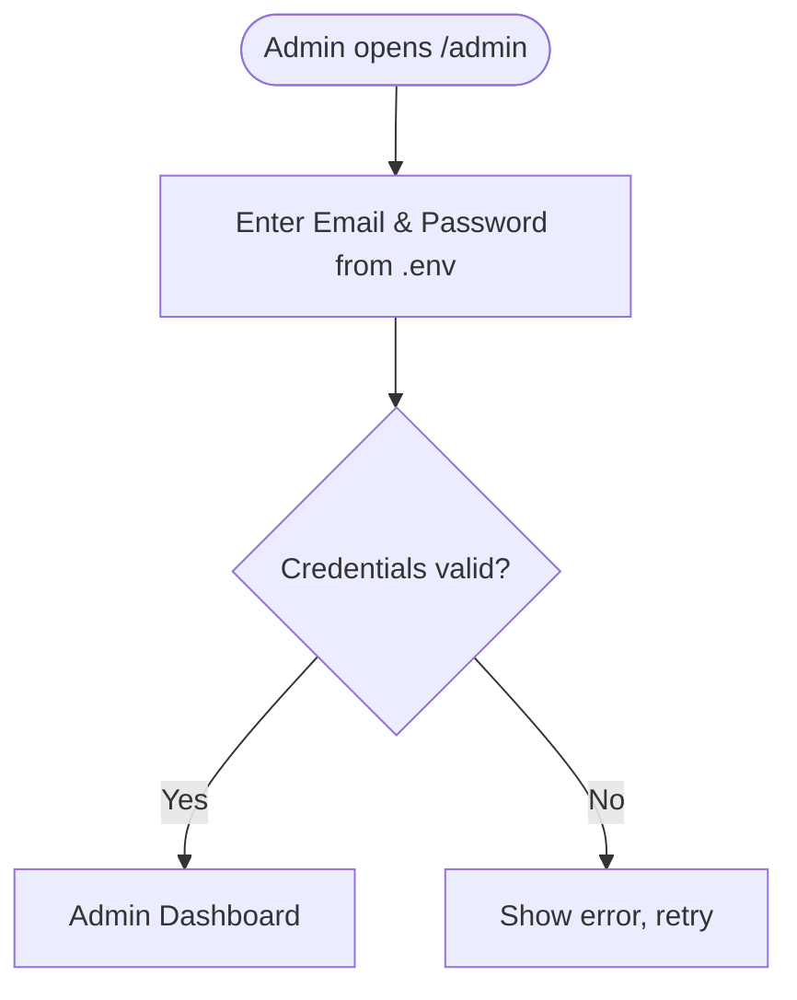

---

### 3.2 Teacher Profile Creation

Super Admin manually collects and creates all teacher profiles. No self-registration.

**Fields collected:**

| Field | Type | Notes |
|---|---|---|
| Teacher Image | File | Profile photo |
| Teacher Name | Text | Full name |
| Phone No | Text | Contact number |
| Email | Email | Used as login credential |
| Password | Text | Master password — stored in main teacher user table |
| Subject | Text | Teaching subject |
| Focused Zone | Multi-select | NEET / JEE / SSC (multiple allowed) |
| Teaching Since | Year | Number of years / year value |
| Degree | Multi-select | BSC, B.ED, MSC, etc. |
| Address | Object | Locality, City, State |

**Devo-coin Crediting:**

| Type | Description |
|---|---|
| Paid | Real money transaction — tracked for profit calculation |
| Gift | Promotional / free coin — tracked separately |

**Teacher Status Management:**

- Active / Inactive toggle
- Soft delete (profile hidden but data retained)

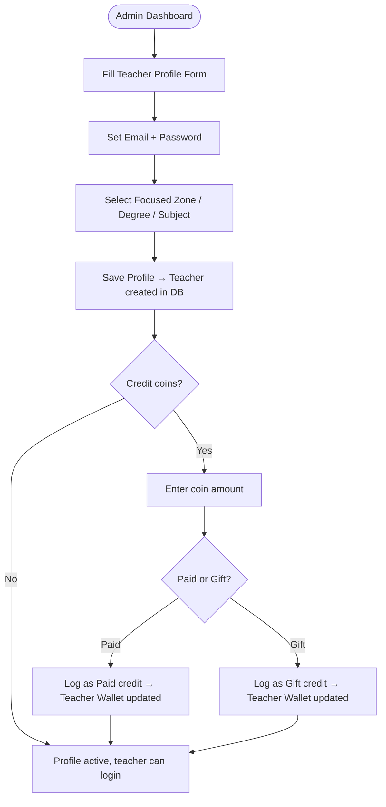

---

### 3.3 Student Profile Listing & Management

- All self-registered student profiles are visible to admin.
- Admin can credit Devo-coins (Paid / Gift) to any student.
- Admin can Active / Inactive or soft-delete any student.

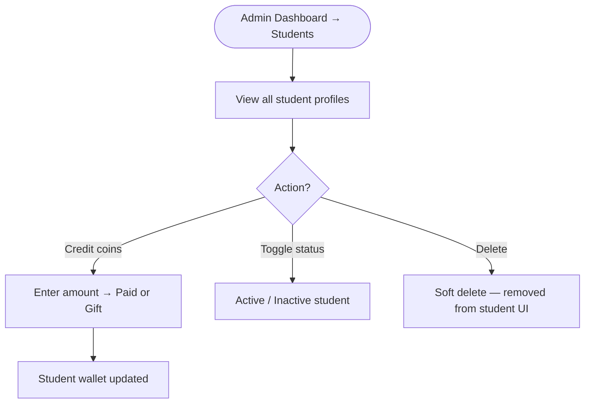

---

### 3.4 Exam Cost Configuration

- Admin sets a **per-question cost** in rupees/coins (e.g., ₹0.15 per question).
- This is a **live global configuration** — changes take effect immediately for all future exam attempts.
- No cost is locked or snapshotted at exam creation time. The rate in effect **at the moment a student clicks Start Exam** is what gets used.

**Cost Formula:**

```
Exam Attempt Cost (per student) = Current Per Question Cost × Number of Questions in Exam
```

**Examples:**

| Per Question Cost | Questions | Cost Per Attempt |
|---|---|---|
| ₹0.15 | 20 | ₹3.00 / 3 coins |
| ₹0.15 | 50 | ₹7.50 / 7.5 coins |

- **Teacher Wallet Deduction:** When a batch-assigned student attempts a private exam — only if teacher wallet has sufficient balance.
- **Student Wallet Deduction:** When a student attempts a global exam — only if student wallet has sufficient balance.
- **Teacher is never charged for global exams** they create — cost is always on the student.

---

## 4. Teacher Flow

### 4.1 Login & Authentication

- Teacher logs in using credentials created by Super Admin.
- Can **change password** anytime via email OTP verification.
- Can use **Forgot Password** on login page — OTP sent to registered email.

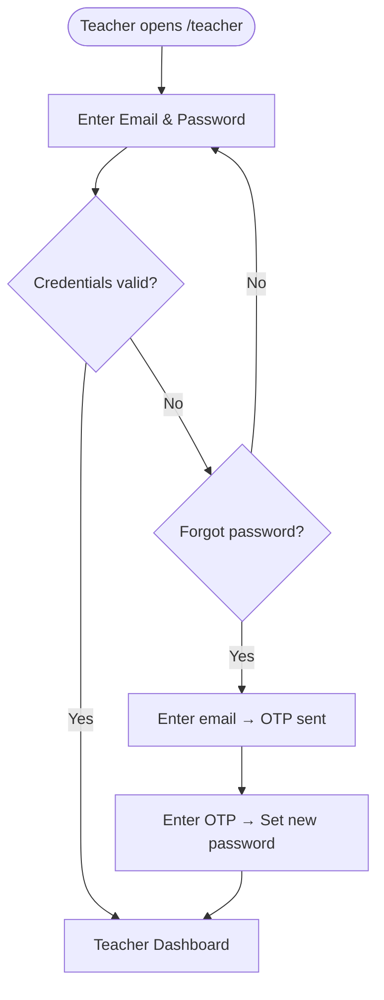

---

### 4.2 Teacher Dashboard

The dashboard reflects the following real-time metrics:

| Widget | Description |
|---|---|
| Total Tests Created | Count of all exams created by this teacher |
| Private Tests | Count of exams marked as private |
| Public Tests | Count of exams marked as public/global |
| Total Students | Number of students linked to this teacher |
| Active Exams | Count of currently active exams |
| Inactive Exams | Count of deactivated exams |
| Wallet Balance | Current Devo-coin balance |
| Transaction History | List of coin credits and deductions |

---

### 4.3 Student Management

- Teacher can search a student by **email address**.
  - If the student account exists → it is shown and can be linked immediately with full details.
  - If not → teacher can still **add that email to their student list**. The entry will appear with only the email address shown (placeholder state) until the student self-registers. Once the student registers with that email, their full profile (name, institute, etc.) automatically populates in the teacher's list.
- Linked students appear in the teacher's student list.

**Actions available per student:**

| Action | Description |
|---|---|
| View Profile | View student's exam history and performance |
| Active / Inactive | Toggle student access |
| Delete | Remove student from teacher's list |
| Gift Coin | Send Devo-coins from teacher wallet to student wallet |

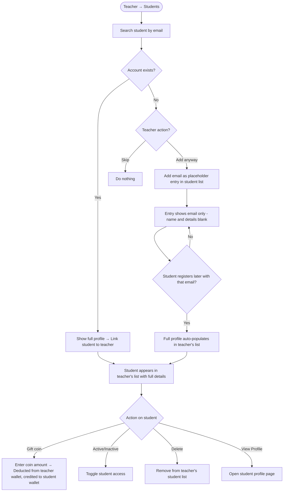

---

### 4.4 Batch Management

- Teacher can create **named batches** to group students.
- A student can belong to **multiple batches** simultaneously.
- Batches are later used to control exam access.

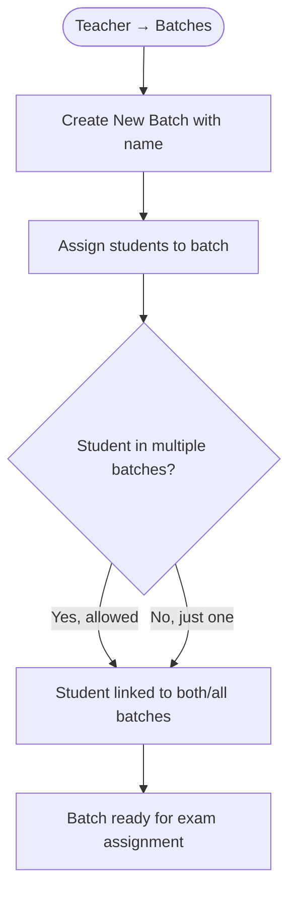

---

### 4.5 Exam Creation

#### Step 1 — Exam Settings

| Field | Type | Notes |
|---|---|---|
| Exam Name | Text | Display name |
| Date | Date | Scheduled date |
| Duration | Minutes | Time limit for the exam |
| Start Time | Time | When exam becomes available |
| End Time | Time | Deadline for exam attempt |
| Language | Single-select | Single Language (English only) OR Bilingual (English + Bengali) |
| Visibility | Toggle | Private (teacher's students only) OR Global (any student on platform) |
| Positive Marks | Decimal | Marks awarded for each correct answer (e.g., +4 for NEET) |
| Negative Marks | Decimal | Marks deducted for each wrong answer (e.g., −1 for NEET). Set to 0 if no negative marking |

#### Step 2 — Section Creation

- Teacher defines **sections** for the exam (e.g., Zoology, Botany, Physics).
- Once created, sections appear in a **dropdown** during question addition.
- New sections can be created inline during question addition.

#### Step 3 — Question Addition

**For Single Language (English only):**

| Field | Description |
|---|---|
| QnEN | Question text in English |
| OpEn1–OpEn4 | 4 answer options in English |
| CurrOp | Correct option identifier |
| Url | Image URL (Cloudinary) — optional |
| Sol | Solution / explanation text |

**For Bilingual (English + Bengali):**

| Field | Description |
|---|---|
| QnEN | Question text in English |
| OpEn1–OpEn4 | 4 answer options in English |
| QnBN | Question text in Bengali |
| OpBn1–OpBn4 | 4 answer options in Bengali |
| CurrOp | Correct option identifier |
| Url | Image URL (Cloudinary) — optional |
| Sol | Solution / explanation text |

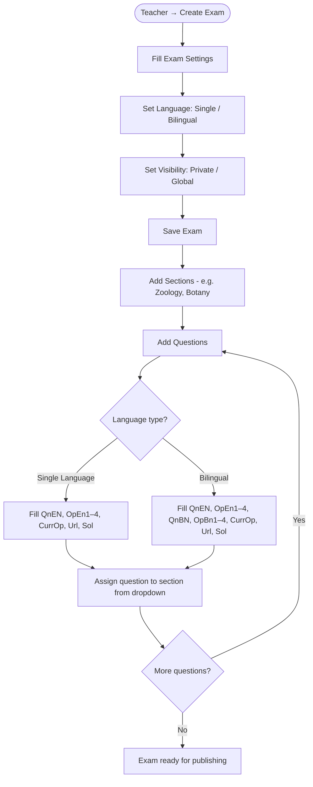

---

### 4.6 Exam Dashboard & Management

All created exams are listed here. Per-exam controls:

| Action | Description |
|---|---|
| Active / Inactive | Toggle exam availability. **Inactive = exam remains visible to students but cannot be attempted (greyed out / disabled Start button)** |
| Delete | Remove from student view (soft or hard delete) |
| Assign Batch | For **Private exams only** — assign one or more batches. Only students in assigned batches can access the exam. Batch assignment is mandatory for private exams. **Not applicable for Global exams** (all platform students can access) |
| Edit Settings | Modify exam date, duration, language, visibility at any time |
| Edit Questions | Teacher **cannot** edit questions once any student has attempted the exam. Exam settings (date, time, duration, visibility) can still be modified. To change questions, teacher must create a new exam |
| View Analytics | Redirect to per-exam analytics page. **For both Private and Global exams**, the teacher can see the list of students who attempted, their scores, time taken, and violation records |

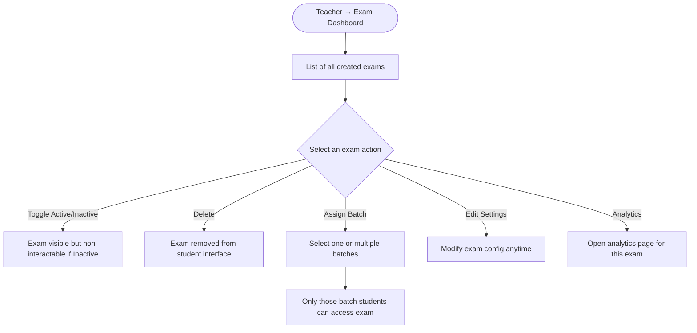

> **Question Lock Rule:** Once the first student submits an attempt for an exam, all questions in that exam are **permanently locked**. This ensures result integrity. Teachers can still modify exam metadata (name, date, start/end time, duration, active/inactive status) but not the question content, options, correct answers, or sections.

---

### 4.7 Student Profile View (from Teacher)

- Teacher can open any linked student's profile.
- View includes:
  - **% Marks Growth Graph** — performance over time (line/area chart)
  - **All Test History** — list of attempted exams with scores
  - **Violation History** — any recorded violations during exams

---

## 5. Student Flow

### 5.1 Registration & Login

**New Student (Sign Up):**

| Field | Notes |
|---|---|
| Name | Full name |
| Phone No | Mobile number |
| Institute Name | Name of the institution |
| Focused Exam | Dropdown: NEET / JEE / SSC / etc. (single selection) |
| Email | Primary key — unique per student |
| Password | Account password |

- After form submission → **OTP sent to email** for verification.
- Account is **only created after OTP verification**.
- On successful registration → account is activated and student can login.

**Returning Student (Login):**

- Email + Password login.
- Forgot Password → OTP to registered email → Set new password.
- Profile → **Change Password → 2-step OTP flow:** Step 1: Send OTP to registered email → Step 2: Enter OTP + new password. No current-password required.

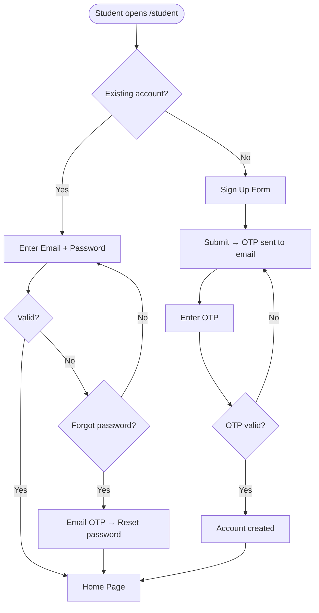

---

### 5.2 Home Page

- Carousel menu at top showing exam categories: **NEET, JEE, SSC, etc.**
- **Default selected category** = student's chosen focused exam (from profile).
- Under each category, two tabs:

| Tab | Description |
|---|---|
| My Exam | Exams assigned by teacher to this student |
| All Exam | All public/global exams available on the platform |

- If **My Exam** tab has content → it is selected by default.
- Otherwise → **All Exam** tab is selected.

---

### 5.3 Exam Attempt Flow

- Active exams are **sorted by date** (upcoming first).
- Inactive exams appear **at the bottom** of the list.

**Before Attempt:**
- Exam card shows **"Start Exam"** button.

**After Attempt:**
- Exam card shows **"View Solution"** button instead.

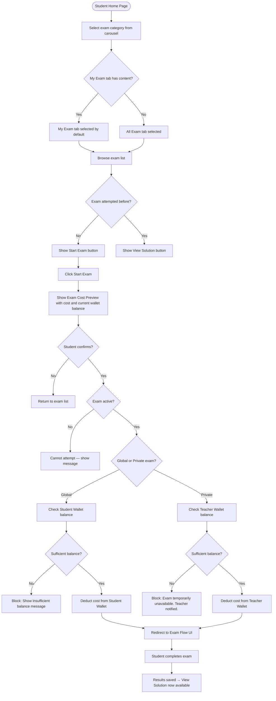

> **Cost Preview:** Before deducting coins, the system shows the student the exact cost of the exam and their current wallet balance. The student must confirm before the attempt begins and coins are deducted. For private exams (teacher-paid), the preview shows: "This exam is sponsored by your teacher. No coins will be deducted from your wallet."

> **Re-Attempt Policy:** A student can attempt each exam **only once**. After submission, the exam card changes to "View Solution" and the "Start Exam" option is permanently unavailable for that student. There is no re-attempt, even if coins are available.

---

### 5.4 Exam Proctoring — Violation Detection

During an active exam attempt, the system enforces **fullscreen mode**. Violations are recorded when the student exits fullscreen.

| Violation Trigger | Action Taken |
|---|---|
| Student exits fullscreen | Violation recorded with timestamp. Exam **does not auto-terminate** — student can return to fullscreen and continue |

- All violations are logged in the `Violation` table with the attempt ID, student ID, violation type (`fullscreen_exit`), and timestamp.
- Teachers can view a student's violation history from the student profile page (§4.7).
- **The exam is never auto-terminated due to violations.** Violations are informational — the teacher decides how to handle them.

---

### 5.5 Session Management & Connection Handling

**Single Device Policy:**
- A student can only be logged in on **one device at a time**.
- If a student logs in from a second device, the first session is automatically terminated.
- If an exam is in progress on the first device when a second login occurs, the attempt continues on the new device from where the student left off (answers are held client-side).

**Connection Drop During Exam:**
- The exam runs entirely on the **frontend (client-side)** once started. Timer, question navigation, and answer selection all work offline.
- If the internet connection drops mid-exam, the student can continue answering questions locally.
- All answers are submitted in a **single API request** when the student clicks "Submit Exam" or when the timer expires.
- If the student's connection is not restored by the time the exam ends, the frontend will **retry submission** when connectivity returns.

> **Important:** Since answers are only sent at final submission, there is **no auto-save to backend** during the exam. If the student closes the browser tab or the device shuts down, all progress is lost and the attempt is recorded as incomplete (no score, but coins are already deducted).

---

### 5.6 Scoring Formula

```
Student Score = (Correct Answers × Positive Marks) − (Wrong Answers × Negative Marks)
```

- **Unanswered questions** are not penalized (no marks added or deducted).
- Score is calculated on the backend after the student submits the attempt.
- Score and total possible marks are stored in the `Exam_Attempt` record.

---

## 6. Coin / Wallet System

### 6.1 Devo-coin Overview

Devo-coin is the platform's virtual currency. Every teacher and student has a wallet.

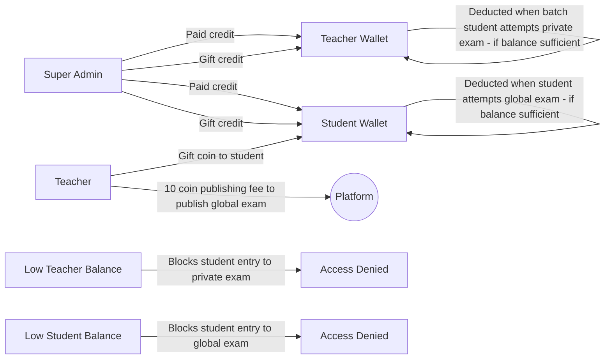

### 6.2 Coin Credit Sources

| Recipient | Source | Credit Type |
|---|---|---|
| Teacher | Super Admin | Paid / Gift |
| Student | Super Admin | Paid / Gift |
| Student | Teacher (gift) | Gift |

### 6.3 Coin Deduction Rules

| Scenario | Wallet Deducted | Amount |
|---|---|---|
| Teacher's batch student attempts teacher's private exam | Teacher Wallet | Current Per Question Cost × Number of Questions in Exam |
| Any student attempts a Global exam | Student Wallet | Current Per Question Cost × Number of Questions in Exam |
| Teacher publishes a Global exam | Teacher Wallet | 10 Devo-coins (Publishing Fee) |

### 6.4 Insufficient Balance — Access Denied

If the wallet responsible for paying the exam cost has insufficient balance, the attempt is **blocked**. The system must check balance **before** allowing exam entry.

| Scenario | Who is blocked | Message shown |
|---|---|---|
| Private exam — teacher wallet low | Student is blocked from entry. **System automatically sends a notification to the teacher** informing them of insufficient balance and the exam name. | "This exam is temporarily unavailable. Your teacher has been notified. Please try again later." |
| Global exam — student wallet low | Student is blocked from entry | "You have insufficient balance. Please contact admin or your teacher to top up." |

> **Teacher Notification on Low Balance:** When a student is blocked from a private exam due to the teacher's insufficient wallet balance, the platform automatically sends an **in-app notification** (and optionally an email) to the teacher, stating:
> - Which exam was affected
> - Which student was blocked
> - Current wallet balance
> - Minimum balance required for one attempt
>
> This removes the burden from the student and gives the teacher actionable information to resolve the issue.

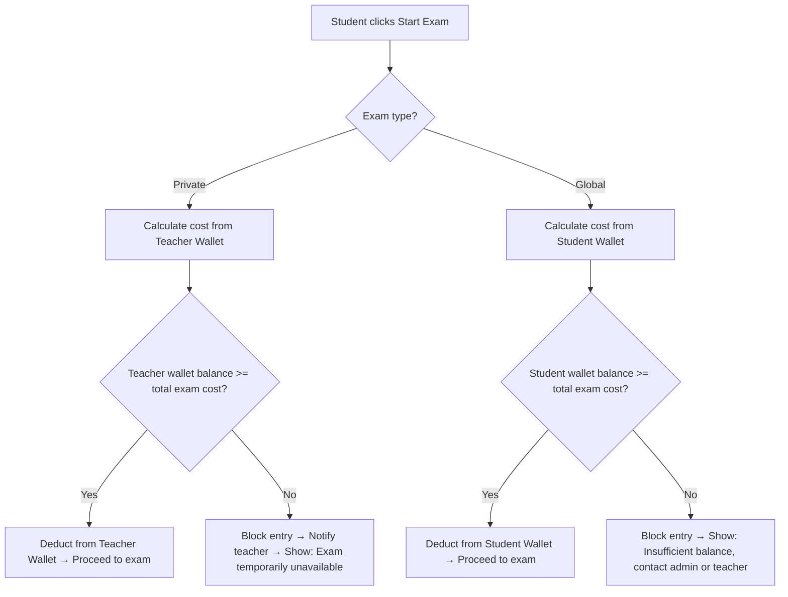

### 6.5 Platform Revenue

When coins are deducted from a teacher or student wallet during an exam attempt, those coins are credited to the **platform revenue pool**. This is how the platform generates revenue from exam usage.

| Deduction Source | Destination |
|---|---|
| Teacher wallet (private exam attempt) | Platform Revenue |
| Student wallet (global exam attempt) | Platform Revenue |
| Teacher wallet (global exam publishing fee) | Platform Revenue |

> **Note:** Float values (fractional coins up to paise level) are permitted in wallet balances and deductions.

---

## 7. Exam Visibility & Cost Logic

### 7.1 Visibility Types

| Type | Who Can Attempt | Cost Deducted From | Teacher Pays? |
|---|---|---|---|
| Private | Only students in batches assigned to this exam | Teacher's wallet | ✅ Yes |
| Global | Any student registered on the platform | Attempting student's own wallet | ⚠️ Yes (10 coin publishing fee at publish time) |

> **Global Exam Rule:** When a teacher marks an exam as Global, the teacher is charged a **one-time 10-coin publishing fee** at the time of publishing. After publishing, the teacher bears no further cost for student attempts. Every student who attempts it pays from their own wallet at the current per-question rate.

### 7.2 Cost Calculation Flow

> **Important:** Exam cost is **always calculated at the time of attempt** using the **current/latest per-question cost** set by admin. There is no cost snapshot stored at exam creation time. If admin updates the per-question rate, all future exam attempts (including existing exams) will use the new rate.

> **Mid-Exam Rate Change:** If the admin changes the per-question cost while a student is mid-exam, the student is **not affected**. The cost was already calculated and deducted at the time the student clicked "Start Exam." Rate changes only affect **future exam entries**, not in-progress attempts.

> **Audit Trail:** When coins are deducted at exam entry, the `cost_per_question_snapshot` at that moment is stored in the `Exam_Attempt` record. This ensures that even if the admin later changes the per-question rate, there is a historical record of what the student was actually charged.

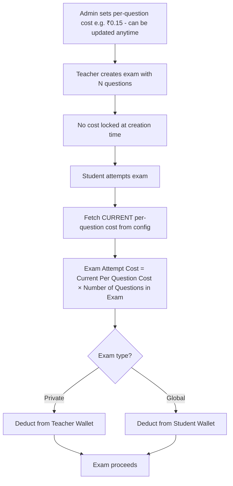

### 7.3 Batch-Based Access Control

**Rule:** Every private exam **must be assigned to at least one batch**. Students gain access to an exam only if they are in an assigned batch. A student who exists in the teacher's student list but is **not in any assigned batch** for that exam will **not** see or access the exam.

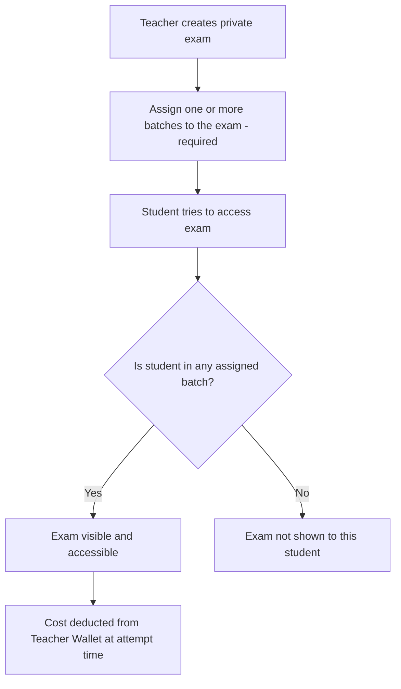

---

## 8. Data Models (Summary)

### Users Table (All Roles)

| Field | Type | Notes |
|---|---|---|
| id | UUID | Primary key |
| role | Enum | super_admin / teacher / student |
| email | String | Unique, primary identity |
| password | String | Hashed |
| name | String | Full name |
| phone | String | Mobile number |
| is_active | Boolean | Active/inactive status |
| is_deleted | Boolean | Soft delete flag |
| created_at | Timestamp | |

### Teacher Extended Profile

| Field | Type |
|---|---|
| image_url | String |
| subject | String |
| focused_zones | String[] |
| teaching_since | Year |
| degrees | String[] |
| locality | String |
| city | String |
| state | String |

### Student Extended Profile

| Field | Type |
|---|---|
| institute_name | String |
| focused_exam | String (NEET/JEE/SSC…) |

### Wallet

| Field | Type | Notes |
|---|---|---|
| wallet_id | UUID | Primary key |
| user_id | UUID | FK → Users (one wallet per user) |
| balance | Decimal | Current coin balance (supports paise-level fractions) |
| updated_at | Timestamp | Last balance update time |

### Transaction

| Field | Type | Notes |
|---|---|---|
| transaction_id | UUID | Primary key |
| wallet_id | UUID | FK → Wallet |
| user_id | UUID | FK → Users |
| transaction_type | Enum | credit / debit |
| credit_type | Enum | paid / gift / auto (only for credits) |
| amount | Decimal | Transaction amount |
| reason | String | exam_attempt / gift / admin_credit / publishing_fee |
| reference_id | UUID | Nullable — FK to exam_attempt_id or exam_id for traceability |
| created_at | Timestamp | |

### Exam

| Field | Type | Notes |
|---|---|---|
| exam_id | UUID | |
| teacher_id | UUID | FK → Users |
| name | String | |
| scheduled_date | Date | |
| start_time | Time | |
| end_time | Time | |
| duration_minutes | Integer | |
| language | Enum | single / bilingual |
| visibility | Enum | private / global |
| positive_marks | Decimal | Marks for correct answer |
| negative_marks | Decimal | Marks deducted for wrong answer (0 = no negative marking) |
| is_active | Boolean | |
| is_deleted | Boolean | |

### Exam_Cost_Config (Global Configuration)

| Field | Type | Notes |
|---|---|---|
| config_id | UUID | Primary key |
| cost_per_question | Decimal | Current per-question cost in coins (e.g., 0.15) |
| global_exam_publishing_fee | Decimal | Flat fee for publishing a global exam (default: 10 coins) |
| updated_by | UUID | FK → Users (super admin who last changed it) |
| updated_at | Timestamp | When the config was last changed |

> **Note:** This is a single-row configuration table. Only the latest row/values are active. Changes take immediate effect for all future exam attempts.

### Section

| Field | Type |
|---|---|
| section_id | UUID |
| exam_id | UUID |
| name | String |

### Question

| Field | Type | Notes |
|---|---|---|
| question_id | UUID | |
| exam_id | UUID | |
| section_id | UUID | |
| qn_en | Text | English question |
| op_en_1..4 | Text | English options |
| qn_bn | Text | Bengali question (bilingual only) |
| op_bn_1..4 | Text | Bengali options (bilingual only) |
| correct_option | String | |
| image_url | String | Cloudinary URL (Phase 2) |
| image_public_id | String | Cloudinary public_id for cleanup on delete/replace (Phase 2) |
| solution | Text | |

### Batch

| Field | Type |
|---|---|
| batch_id | UUID |
| teacher_id | UUID |
| name | String |

### Teacher_Student (Teacher ↔ Student Link)

| Field | Type | Notes |
|---|---|---|
| teacher_id | UUID | FK → Users |
| student_id | UUID | FK → Users — nullable if student not yet registered |
| invited_email | String | Email used to add student — always stored |
| status | Enum | `pending` (email added, not yet registered) / `active` (registered and linked) |
| linked_at | Timestamp | When student registered and profile populated |

> **Placeholder logic:** When a teacher adds an unregistered email, a `pending` row is created with `student_id = null` and `invited_email = email`. On student registration, the system checks `invited_email` matches, then sets `student_id` and flips status to `active`.

### Batch_Student (Batch ↔ Student Assignment)

| Field | Type |
|---|---|
| batch_id | UUID |
| student_id | UUID |

### Exam_Batch (Exam ↔ Batch Assignment)

| Field | Type |
|---|---|
| exam_id | UUID |
| batch_id | UUID |

### Exam_Attempt

| Field | Type | Notes |
|---|---|---|
| attempt_id | UUID | Primary key |
| exam_id | UUID | FK → Exam |
| student_id | UUID | FK → Users |
| answers | JSONB | Object mapping question_id → selected_option for all questions |
| score | Decimal | Calculated score based on marking scheme |
| total_marks | Decimal | Maximum possible marks for this exam |
| time_taken_seconds | Integer | Actual time spent by student (in seconds) |
| coin_deducted | Decimal | Coins deducted for this attempt |
| cost_per_question_snapshot | Decimal | Per-question rate at time of attempt (for audit purposes) |
| wallet_deducted_from | Enum | `teacher` or `student` — records which wallet paid |
| is_submitted | Boolean | `false` while exam is in progress, `true` after submission. An attempt exists from the moment the student starts (coins already deducted). If `false` and `attempted_at + duration + 30min < now`, the attempt is timed-out/incomplete. |
| attempted_at | Timestamp | When the attempt started |
| submitted_at | Timestamp | When the attempt was submitted (null if not submitted) |

### Violation

| Field | Type |
|---|---|
| violation_id | UUID |
| attempt_id | UUID |
| student_id | UUID |
| type | String |
| recorded_at | Timestamp |

---

## 9. Full System Flow Diagram

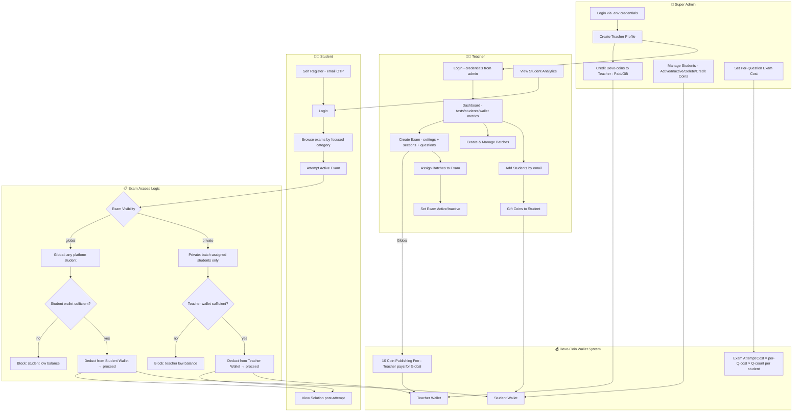

---

## Appendix — Key Business Rules

| Rule | Detail |
|---|---|
| Teacher account creation | Only by Super Admin — no self-registration |
| Student email | Primary key — must be unique across platform |
| Unregistered student invite | Teacher can add any email to their student list. Entry shows email only (placeholder/pending state). Once the student registers with that email, full profile auto-populates and link is activated |
| Exam attempt eligibility | Student must be active; exam must be active; relevant wallet must have sufficient balance |
| Re-attempt policy | Students can attempt each exam only once. No re-attempts allowed |
| Batch assignment controls access | For **private exams only** — exam must be assigned to at least one batch for students to access it. Students not in any assigned batch cannot see or attempt the exam — even if linked to the teacher. Not applicable for global exams |
| Global exam cost | Teacher pays a **10-coin publishing fee** at publish time. Every student who attempts it pays from their **own wallet** at the current per-question rate |
| Teacher wallet deduction | Happens only for **private exams** when a batch-assigned student attempts. Teacher wallet must have sufficient balance or entry is blocked |
| Insufficient balance — private exam | Student is blocked from starting. System automatically notifies the teacher. Student sees: "This exam is temporarily unavailable. Your teacher has been notified." |
| Insufficient balance — global exam | Student is blocked from starting; shown message that their own balance is insufficient |
| Exam cost rate | Always the **current admin-configured per-question rate** at the time of attempt. No rate is locked at exam creation. Rate changes apply to all future attempts immediately. In-progress attempts are not affected |
| Cost per question snapshot | The per-question rate at time of attempt is stored in the Exam_Attempt record for audit purposes |
| Marking scheme | Each exam defines positive marks (per correct answer) and negative marks (per wrong answer). Unanswered questions are not penalized |
| Question lock | Once the first student submits an attempt, all questions in that exam are permanently locked. Teacher can still modify exam metadata but not questions |
| Bilingual fallback | System must serve correct language based on exam settings |
| Inactive exam | Students cannot attempt; remains visible but non-interactable |
| Deleted exam | Removed from all student-facing views |
| Soft delete (teacher/student) | Record retained in DB; hidden from UI |
| Soft delete (teacher) — exam impact | When a teacher is soft-deleted, **all their exams become inaccessible** to students. Private exams are hidden. Global exams are removed from the public listing. Existing attempt data and results are retained in the database for historical reference |
| Violation detection | Fullscreen exit triggers a violation record. Exam does not auto-terminate. Teacher reviews violations from student profile |
| Session management | Single device login only. Second login terminates first session |
| Connection drop | Exam runs on frontend. All answers submitted in single request at end. No mid-exam auto-save to backend |
| Password authority | Admin sets the initial password during teacher creation. Teacher can change it anytime via email OTP. The **most recently set password** (whether by admin or teacher) is always the active one. Admin can reset a teacher's password from the admin panel, which overrides the teacher's current password |

---

*Document updated with owner clarifications. Version 1.2.*